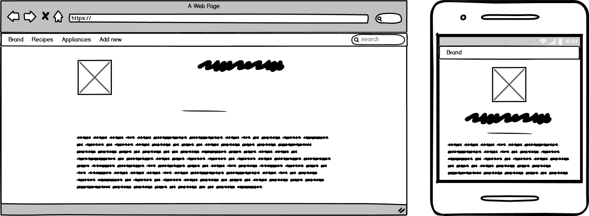

# Data-centric Development Project

[](https://travis-ci.com/faithy80/dcd-project)

The purpose of this project is to advertise branded cooking appliances via community shared food recipes on a full-stack website. The site also gives an opportunity to search for the existing recipes or to share our own favorite recipes.

## UX

The mobile-first approach design was implemented on this website to maintain the user experience from mobile devices to desktop computers. Bootstrap framework is responsible for the responsive design.

### Database structure

Creating the database structure was the first step in the development. There are 4 collections.

### Wireframes

Home page

Search page

View page

Home page


## Demo

A live demo is hosted by the Heroku server. Click [here](http://dcd-project.herokuapp.com/) to open the web application.

## User stories

As a user, I should be able to:

* [x] browse recipes, so I can prepare new meal following the recipe steps.

* [x] add new recipes and / or recipe categories, so I can share my favorite recipes on the website.

* [x] browse cooking appliances, so I can buy modern devices to prepare my meal.

As an owner / developer, I should be able to:

* [x] modify existing recipes and / or recipe categories, so I can fix mistakes.

* [x] delete existing recipes and / or recipe categories, so I can remove not so popular recipes to keep the website organized.  

* [ ] add more cooking appliances and applicance categories to the database, so the users can discover more devices to buy.

## Technologies

### Languages

* HTML5
* CSS3
* JavaScript  
* Python (3.6)

### Libraries and frameworks

* [Bootstrap (4.4.1)](https://getbootstrap.com/) framework for developing responsive websites
* [jQuery (3.4.1)](https://jquery.com/) library to use JavaScript easier on the website
* [Hover CSS (2.3.1)](https://ianlunn.github.io/Hover/) library to apply effects on the HTML elements
* [Fontawesome (4.7.0)](https://fontawesome.com/v4.7.0/) library for custom icons
* [Flask (1.1.2)](https://pypi.org/project/Flask/) framework to build the web application
* [Flask-Pymongo (2.3.0)](https://pypi.org/project/Flask-PyMongo/) library to connect to the MongoDB database from the web application

### Hosting, deployment and testing

* [Git](https://git-scm.com/) for version control
* [Github](https://github.com/) for code hosting
* [Heroku](https://heroku.com) for app deployment
* [Travis-CI](https://travis-ci.com/) for test deployment  
* [MongoDB](https://www.mongodb.com/) for non-relational database hosting

## Deployment

The source code of the website is deployed to Github and the web application is hosted by Heroku. They both update automatically on a new commit and push to the master branch of the Github repository.

### Local deployment

To run a web application, I am using VSCode on WSL (Windows Subsystem for Linux) in Windows 10. WSL allows me to run Ubuntu 18.04 LTS in a virtual environment making the local development very convenient. Also, Cloud9 and the other similar services become unnecessary. The following links may be useful to setup WSL and VScode:

* [Windows Subsystem for Linux Installation Guide for Windows 10](https://docs.microsoft.com/en-us/windows/wsl/install-win10)
* [Developing in WSL](https://code.visualstudio.com/docs/remote/wsl)
* [Run in Windows Subsystem for Linux](https://code.visualstudio.com/remote-tutorials/wsl/run-in-wsl)
* [The Ultimate Guide To Use VS Code With Windows Subsystem for Linux (WSL)](https://dev.to/ajeet/the-ultimate-guide-to-use-vs-code-with-windows-subsystem-for-linux-wsl-51hc)

After the environment is prepared, open Ubuntu 18.04 LTS application to start the Ubuntu environment. Use ```sudo apt update && sudo apt upgrade``` to run the update first. If git and pip3 packages are not installed, use ```sudo apt install git python3-pip``` to install the missing packages. Command ```python3 --version``` returns the version number for python. Version 3.6 is required to run this application.

Use ```git clone  https://github.com/faithy80/dcd-project.git``` to clone the git repository. Also, use ```cd dcd-project/``` to change current directory.

To restore the database, these steps should be followed:

* create a free tier account on [mongodb.com](https://www.mongodb.com/)
* build a new cluster
* add an admin user in Database Access menu. This step allows to access the database.
* add 0.0.0.0/0 to the IP whitelist in Network Access menu. This step allows to access the mongoDB server from any IP adresses.
* run ```mongorestore --host <host_name> --ssl --username <root_username> --password <password> --authenticationDatabase admin``` from the root folder of the git archive (dcd-project). The proper command line with the host name can be found in Clusters/Command Line Tools menu on mongoDB.com

The last step of the local deployment is to set the environmental variables to gain access to the database from the web application.
Use ```export MONGO_URI="<mongoDB_uri>"``` and ```export MONGO_DBNAME="<database_name>"``` commands. The <mongoDB_uri> can be found in the Clusters/Connect/Connect your application menu on the mongoDB server. Choose Python 3.6 or above to get the correct connecion string. If the database was restored from the backup I provided, the <database_name> will be 'myTestDB'. If we add the export commands to the .bashrc file inn the home directory, the variables will be set each time the environment is started. To edit the .bashrc file, use ```nano ~/.bashrc``` command. Place the export commands to the bottom of the file. Use CTRL + O to save the file and CTRL + X to exit the text editor.

After all these steps, we can start VSCode using the ```code .``` command. To start the application, we need to open run.py in the editor window and start it using the little green 'play' button int the top right corner of the VSCode window.
